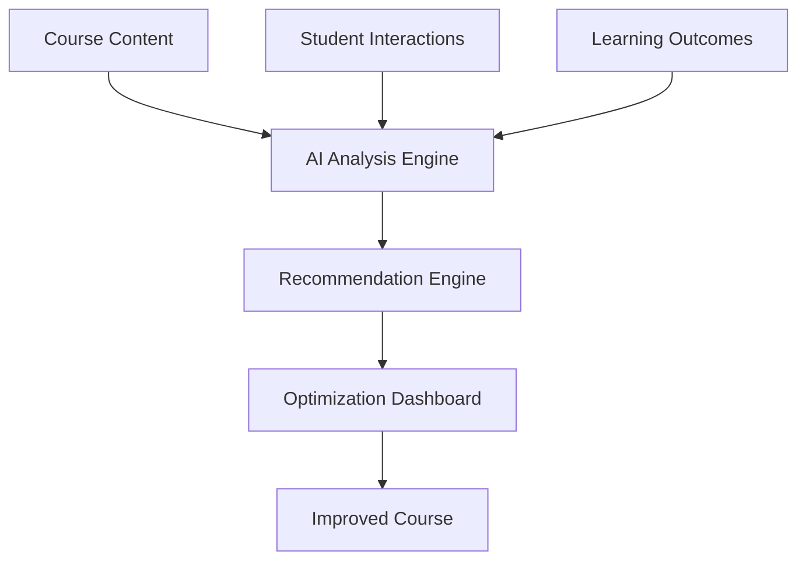
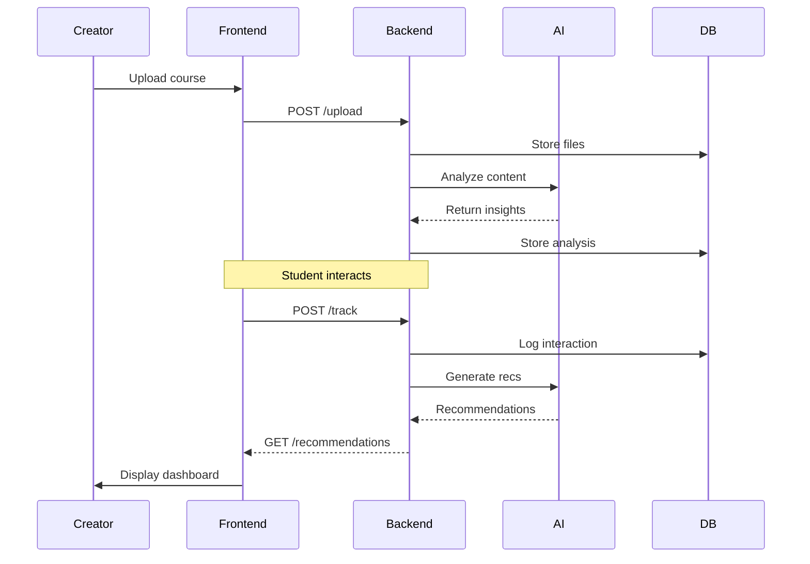

# CourseFlow

[](https://opensource.org/licenses/MIT)
[](https://github.com/decagondev/course-flow/stargazers)
[](https://github.com/decagondev/course-flow/network)

## Description

**CourseFlow** is an AI-powered course optimization platform designed to help online course creators maximize student engagement and learning outcomes. By analyzing course content, tracking real-time student interactions, and delivering actionable, personalized recommendations, CourseFlow empowers educators to refine their courses for better structure, pacing, and retention.

> *“Upload your course. Understand your students. Optimize for success — automatically.”*

This project is built based on a comprehensive Product Requirements Document (PRD) and aims to revolutionize online education by providing data-driven insights in an easy-to-use interface.

## Table of Contents

- [Features](#features)
- [Installation](#installation)
- [Usage](#usage)
- [Architecture](#architecture)
- [Tech Stack](#tech-stack)
- [Contributing](#contributing)
- [License](#license)
- [Roadmap](#roadmap)
- [Contact](#contact)

## Features

- **Course Content Upload & Analysis**: Upload PDFs, videos, quizzes, and slides for AI-driven parsing of structure, readability, and pacing.
- **Real-Time Student Interaction Tracking**: Capture clicks, time-on-page, skips, rewinds, and quiz attempts to identify engagement patterns.
- **AI-Powered Optimization Engine**: Combines content analysis, behavior data, and learning outcomes to generate tailored recommendations.
- **Personalized Recommendations Dashboard**: Visual, prioritized suggestions with impact and effort scores for quick decision-making.
- **Learning Outcome Correlation**: Maps interactions to metrics like completion rates, quiz scores, and feedback sentiment.

For detailed user stories and specifications, refer to [PRD.md](docs/PRD.md) in the repository.

## Installation

### Prerequisites

- Node.js ≥ 14
- MongoDB (local or cloud instance)
- API keys for AI services (e.g., Google Cloud AI, OpenAI, or similar)

### Steps

1. Clone the repository:
   ```
   git clone https://github.com/decagondev/course-flow.git
   cd course-flow
   ```

2. Install dependencies:
   - For backend:
     ```
     cd backend
     npm install
     ```
   - For frontend:
     ```
     cd ../frontend
     npm install
     ```

   - Tailwind CSS v4 setup (frontend):
     - Ensure Tailwind v4 is installed (no PostCSS needed by default):
       ```
       npm install -D tailwindcss @tailwindcss/cli
       ```
     - In your main app stylesheet (e.g., `src/index.css`), add:
       ```
       @import "tailwindcss";
       ```
     - Run the Tailwind CLI during development/build (example):
       ```
       npx tailwindcss -i ./src/index.css -o ./src/tailwind.css --watch
       ```
       Then import the generated `./src/tailwind.css` in your React entry (or wire a script in `package.json`).
     - Optional theming (Tailwind v4): define tokens in CSS using `@theme`:
       ```
       @theme {
         colors: {
           brand: #0ea5e9;
         };
       }
       ```
       See Tailwind v4 docs for details.

3. Set up environment variables:
   - Create `.env` files in both frontend and backend directories.
   - Example for backend `.env`:
     ```
     MONGO_URI=mongodb://localhost:27017/courseflow
     AI_API_KEY=your_ai_api_key_here
     PORT=3000
     ```
   - Example for frontend `.env`:
     ```
     VITE_API_URL=http://localhost:3000/api
     ```

4. Start the database (if local MongoDB):
   ```
   mongod
   ```

## Usage

1. Start the backend server:
   ```
   cd backend
   npm run dev
   ```

2. Start the frontend development server:
   ```
   cd frontend
   npm run dev
   ```

3. Open the app in your browser at `http://localhost:5173` (default Vite port).

4. Upload a course:
   - Navigate to the upload page.
   - Select course files and submit.
   - View analysis and recommendations in the dashboard.

For detailed API endpoints, see [API.md](docs/API.md).

## Architecture

### High-Level Overview



### Data Flow



For full technical details, see [PRD.md](docs/PRD.md).

## Tech Stack

- **Frontend**: Vite + React + TypeScript + Tailwind CSS v4
- **Backend**: Express.js + Node.js
- **Database**: MongoDB (or PostgreSQL)
- **AI Integration**: External APIs (e.g., Google Vertex AI, Azure Cognitive Services)
- **File Processing**: PDF.js, Tesseract (OCR), FFmpeg (video)
- **Testing**: Jest, Cypress
- **Deployment**: AWS/GCP/Vercel (frontend) + Render/Heroku (backend)

## Contributing

We welcome contributions! Please follow these steps:

1. Fork the repository.
2. Create a feature branch: `git checkout -b feature/YourFeature`.
3. Commit your changes: `git commit -m 'feat: add YourFeature'`.
4. Push to the branch: `git push origin feature/YourFeature`.
5. Open a Pull Request.

See [CONTRIBUTING.md](CONTRIBUTING.md) for detailed guidelines, including commit conventions and PR templates.

## License

This project is licensed under the MIT License - see the [LICENSE](LICENSE) file for details.

## Roadmap

- **v1.0**: MVP with core upload, tracking, and recommendations.
- **v1.1**: LMS integrations (e.g., Canvas, Moodle).
- **v1.2**: A/B testing for course variants.
- **v2.0**: Auto-generate improved course outlines.

Track progress in [issues](https://github.com/decagondev/course-flow/issues) and [projects](https://github.com/decagondev/course-flow/projects).

## Contact

- **Maintainer**: Decagon Dev (tom@decadev.co.uk)
- **Issues**: Report bugs or suggest features [here](https://github.com/decagondev/course-flow/issues).
- **Discussions**: Join the conversation in [discussions](https://github.com/decagondev/course-flow/discussions).

Thank you for checking out CourseFlow! If you find it useful, please star the repo ⭐.
