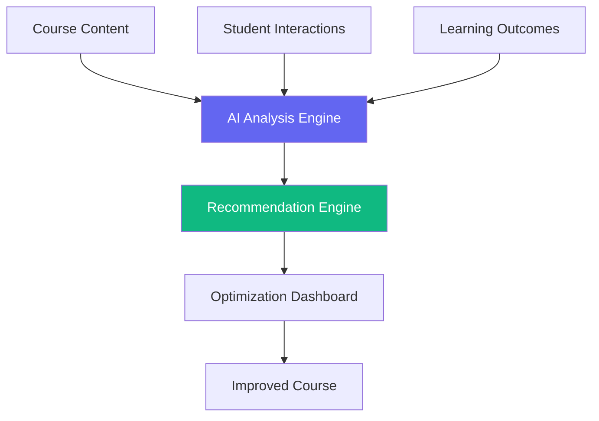
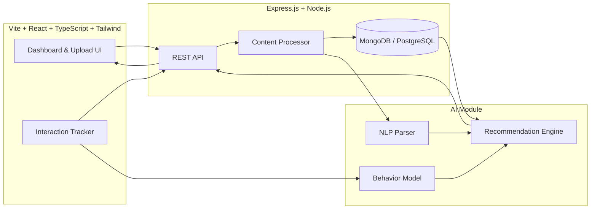
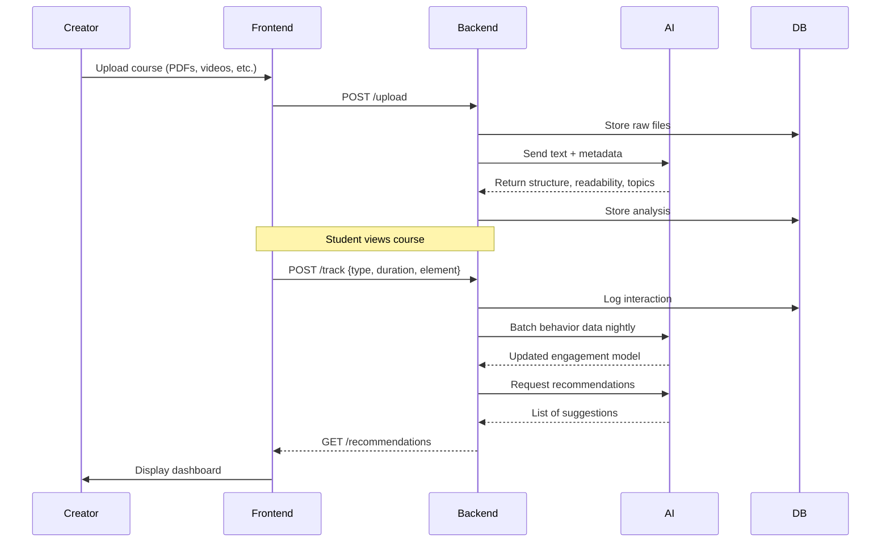
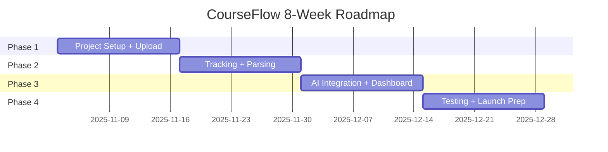
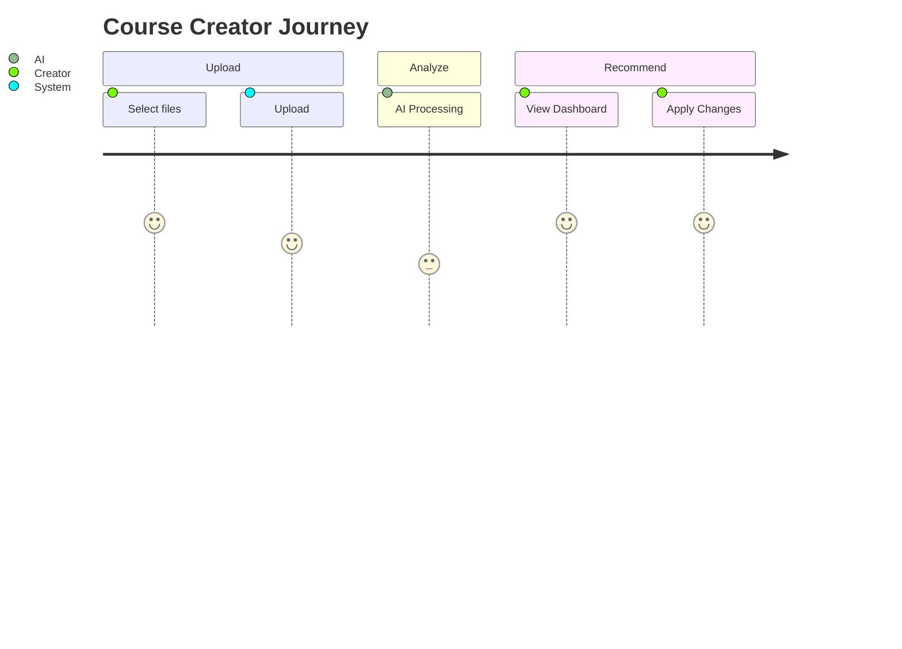

# CourseFlow Product Requirements Document (PRD)

**Version:** 1.0  
**Date:** October 29, 2025  
**Product Owner:** Tom Tarpey  
**Target Audience:** Technical Team (Frontend, Backend, AI), Non-Technical Stakeholders (PM, Design, Marketing), AI/ML Engineers

---

## 1. Elevator Pitch

**CourseFlow** is an **AI-powered course optimization platform** that empowers online course creators to **maximize student engagement and learning outcomes** by analyzing course content, tracking real-time student interactions, and delivering **actionable, personalized recommendations** for course improvement.

> *“Upload your course. Understand your students. Optimize for success — automatically.”*

---

## 2. Executive Summary

CourseFlow bridges the gap between course creation and data-driven optimization. It uses **AI to analyze content structure, student behavior, and learning patterns**, then delivers **clear, prioritized recommendations** to improve course flow, engagement, and completion rates.

Built for **independent course creators, instructional designers, and LMS administrators**, CourseFlow integrates seamlessly into existing workflows and scales with course complexity.

---

## 3. Market Analysis

| Aspect | Insight |
|------|--------|
| **Market Size** | Global online education market: **$325B by 2025** |
| **Growth Drivers** | Rising competition, demand for engagement, retention pressure |
| **Current Gaps** | Manual analysis, basic analytics, no AI-driven course structure optimization |
| **Competitive Edge** | **AI-powered structural + behavioral insights**, not just usage stats |

---

## 4. User Personas

### **Primary: Fred – Online Course Creator**
- **Role:** Independent educator on Udemy, Teachable, or self-hosted
- **Goals:** Increase completion rates, boost ratings, grow enrollments
- **Pain Points:** 
  - Can’t see *where* students drop off
  - Unsure if content is too dense, boring, or misordered
  - No time for manual analytics
- **Needs:** Simple upload → clear recommendations → fast wins

### **Secondary: Samantha – Instructional Designer**
- **Role:** Builds courses for institutions or agencies
- **Needs:** Validate structure, align with learning science, iterate quickly

### **Tertiary: Alex – Course Administrator**
- **Role:** Manages 10+ courses
- **Needs:** Dashboard of engagement trends, bulk optimization suggestions

---

## 5. Problem Statement

> **Online course creators lack actionable, AI-driven insights into how students actually experience their content — leading to high dropout rates (70%+ on average) and stagnant course performance.**

### Core Problems:
1. **Blind Spots in Content Flow** – No visibility into pacing, difficulty spikes, or confusion points
2. **Fragmented Student Data** – Interactions scattered across platforms
3. **No Personalization at Scale** – One-size-fits-all courses underperform
4. **Manual Optimization is Impractical** – Too slow, subjective, and unscalable

---

## 6. Solution Overview



**CourseFlow** collects, analyzes, and recommends — in one loop.

---

## 7. Key Features

| Feature | Description | Owner |
|-------|-----------|-------|
| **1. Course Content Upload & Analysis** | Upload PDFs, videos, quizzes, slides → AI parses structure, readability, pacing | Backend + AI |
| **2. Real-Time Student Interaction Tracking** | Capture clicks, time-on-page, skips, rewinds, quiz attempts | Frontend + Backend |
| **3. AI-Powered Optimization Engine** | Combines content + behavior + outcomes → generates recommendations | AI Team |
| **4. Personalized Recommendations Dashboard** | Visual, prioritized, filterable suggestions with impact scores | Frontend + Design |
| **5. Learning Outcome Correlation** | Map interactions to quiz scores, completion, feedback | AI + Backend |

---

## 8. User Stories (Prioritized)

| ID | As a... | I want to... | So that... | Priority |
|----|--------|--------------|------------|----------|
| US-01 | Course Creator | Upload my course materials | They can be analyzed by AI | Must-Have |
| US-02 | Course Creator | See where students get stuck or drop off | I can fix pain points | Must-Have |
| US-03 | Course Creator | Get specific recommendations (e.g., “Shorten Lesson 3”, “Add quiz after video”) | I can act fast | Must-Have |
| US-04 | Course Creator | Filter recommendations by impact or effort | I can prioritize | Should-Have |
| US-05 | Course Creator | Track engagement over time | I can measure improvements | Should-Have |

---

## 9. Technical Architecture



### Tech Stack
| Layer | Technology |
|------|------------|
| **Frontend** | Vite + React + TypeScript, Tailwind CSS v4 |
| **Backend** | Express.js, Node.js ≥ 14 |
| **Database** | MongoDB (flexible) or PostgreSQL (relational) |
| **AI Integration** | REST API to external AI provider (e.g., Google Vertex, Azure Cognitive, or custom LLM) |
| **File Processing** | PDF.js, Tesseract (OCR), FFmpeg (video metadata) |
| **Hosting** | AWS / GCP / Vercel + Render |

---

## 10. Data Flow



---

## 11. AI Module Specifications

| Input | Processing | Output |
|------|-----------|--------|
| **Course Text** | NLP: chunking, readability (Flesch), topic modeling | Structure map, difficulty curve |
| **Video Transcripts** | Speech-to-text, pacing analysis | Speaking speed, filler words |
| **Quizzes** | Item response theory, difficulty/distractor analysis | Question quality score |
| **Interactions** | Clickstream → heatmaps, drop-off points | Engagement funnels |
| **Outcomes** | Completion %, scores, feedback sentiment | Success predictors |

### Recommendation Types
| Type | Example | Impact Score |
|------|--------|--------------|
| **Structural** | “Move Quiz 2 before Video 4” | High |
| **Content** | “Shorten Lesson 3 by 40%” | Medium |
| **Engagement** | “Add interactive poll after slide 12” | High |
| **Pacing** | “Add breakout activity every 7 mins” | Medium |

---

## 12. UI/UX Requirements

### Dashboard Views
1. **Overview Tab** – Engagement %, completion rate, AI confidence
2. **Heatmap View** – Where students click, pause, skip
3. **Recommendations Tab** – Cards with:
   - Title
   - Description
   - Effort (Low/Med/High)
   - Impact (1–10)
   - “Apply” button (future)
4. **Analytics Over Time** – Trend graphs

### Design Principles
- **Clarity over complexity**
- **Action-oriented language**
- **Visual before text**
- **Mobile-responsive**

---

## 13. Implementation Plan (8 Weeks)

| Phase | Weeks | Goals | Deliverables |
|-------|-------|-------|------------|
| **Phase 1: Foundation** | 1–2 | Setup + Upload | Project repo, upload UI, file storage |
| **Phase 2: Tracking & Analysis** | 3–4 | Track + Parse | Interaction logger, content parser |
| **Phase 3: AI & Recommendations** | 5–6 | AI integration + UI | Rec engine, dashboard MVP |
| **Phase 4: Polish & Launch** | 7–8 | Test + Iterate | QA, bug fixes, docs |

### Week-by-Week Breakdown



---

## 14. Task Breakdown (Technical)

| Task | Owner | Est. Effort |
|------|-------|-------------|
| Initialize Vite + React + TS | Frontend | 0.5d |
| Setup Express + MongoDB | Backend | 0.5d |
| File upload endpoint (multipart) | Backend | 1d |
| PDF/text extraction service | Backend | 1.5d |
| Interaction tracking SDK | Frontend | 1d |
| AI API wrapper (async) | AI/Backend | 2d |
| Recommendation engine logic | AI | 3d |
| Dashboard UI (recommendations) | Frontend | 3d |
| Heatmap visualization | Frontend | 2d |
| Testing (unit + e2e) | All | 3d |

---

## 15. Success Metrics (KPIs)

| Metric | Target | Measurement |
|--------|--------|-----------|
| **User Adoption** | 100 creators in beta | Sign-ups |
| **Engagement Lift** | +15% completion rate | Pre/post comparison |
| **Recommendation Acceptance** | 60% acted upon | Click “Apply” or manual edit |
| **NPS** | ≥ 8 | Post-use survey |
| **AI Accuracy** | 80%+ creator agreement | Feedback rating per rec |

---

## 16. Risks & Mitigations

| Risk | Likelihood | Impact | Mitigation |
|------|------------|--------|----------|
| AI gives vague recommendations | Medium | High | Use prompt engineering + human review |
| File parsing fails (poor PDFs) | High | Medium | Fallback to OCR, user warnings |
| Low user adoption | Medium | High | Onboarding tour, templates |
| Data privacy concerns | Low | High | GDPR-compliant, opt-in tracking |

---

## 17. Future Roadmap

| Milestone | Features |
|---------|----------|
| **v1.1** | LMS integrations (Canvas, Moodle) |
| **v1.2** | A/B testing for course variants |
| **v2.0** | Auto-generate improved outlines |
| **v3.0** | Predictive dropout modeling |

---

## 18. Appendix

### A. Code Snippets

#### Content Analysis (TypeScript)
```ts
async function analyzeCourseContent(file: File): Promise<Analysis> {
  const text = await extractText(file);
  const response = await fetch('/api/ai/analyze', {
    method: 'POST',
    body: JSON.stringify({ text, type: file.type })
  });
  return response.json();
}
```

#### Interaction Tracking (JS)
```js
function track(event: string, meta = {}) {
  navigator.sendBeacon('/track', JSON.stringify({
    event, meta, timestamp: Date.now(), userId
  }));
}
```

### B. Mermaid Diagrams

#### User Journey


---

## Conclusion

**CourseFlow** is not just an analytics tool — it’s a **co-pilot for course creators**. By combining **AI depth** with **human-centered design**, it turns data overload into **clear next steps**.

This PRD serves as the **single source of truth** for:
- Engineers building the system
- Designers crafting the experience
- AI teams training the models
- Stakeholders tracking progress

Let’s build the future of online learning — **one optimized course at a time.**

---

**Approved by:**  
Product • Engineering • Design • AI  
**Status:** Ready for Development
